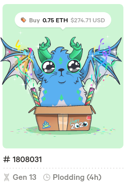
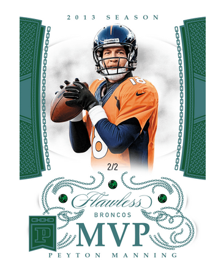
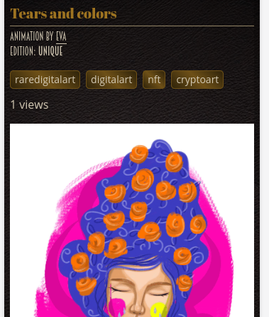
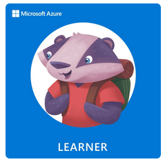
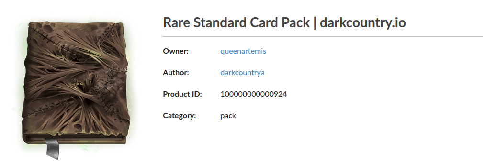

# NFTs

## Storing Digital Items On-Chain

Stacks Foundation Grant - Open Riff  
Blockchain Garage Brussels  
Friedger Müffke - 1st Oct 2020

---

## Blockchain View

- Smartcontract
- Identifier
- Account as owner
- On-chain meta data

Standards: ERC721, dgoods

---

## Blockchain View (2)

|            |                                   |              |
| ---------- | --------------------------------- | ------------ |
| Meta data  | ↦ | Class of NFT |
| Contract   | ↦ | Type of NFT  |
| Identifier | ↦ | NFT          |
|            |                                   |              |

---

## Computer Science View

- Control over a single Database table row
- Database scheme = Meta Data

---

## Social View

- Unique item
- Features
- Value

---

[Cryptokitties](https://www.cryptokitties.co) (2017)

Game / Network Throttle <!-- .element: class="fragment" data-fragment-index="1" -->

---

[Pannini Blockchain](https://www.paniniamerica.net/blockchain.html) (2019)

Collectable / Making Money <!-- .element: class="fragment" data-fragment-index="1" -->

---

[Pixeos](https://gallery.pixeos.art)

Collectable / Art <!-- .element: class="fragment" data-fragment-index="1" -->

---

[Azure Heros](https://microsoft.enjinx.io/eth/platform/3368) (2019)

Badge / Real-World Achievements <!-- .element: class="fragment" data-fragment-index="1" -->

---

[Prospectors](https://prospectors.io/) (2019)

Game items / Play for Profit / Cross Game<!-- .element: class="fragment" data-fragment-index="1" -->

---

## Change of Ownership

- Off-Chain: Simple transfer contract call
- On-Chain: Marketplace contract,  
   e.g. OpenSea, OpenRiff (tba)
- Token with Marketplace

---

## 2020

- Recently hyped
- Profit Sharing (creator + fees property)
- Farm for NFTs [Meme Protocol](https://dontbuymeme.com)
- DAO to buy NFTs [Flamingo](https://flamingodao.xyz/)

---

## Questions?

---

## From the community

- NFT for pool
- Partial ownership of NFT
- https://www.larvalabs.com/cryptopunks
- https://superrare.co/
- https://knownorigin.io/
- https://rabbidstoken.ubisoft.com/
- https://niftygateway.com/whatisanifty
- [NFTs on OpenSea](https://opensea.io/blog/guides/non-fungible-tokens/)
- https://nifty.ink

---
